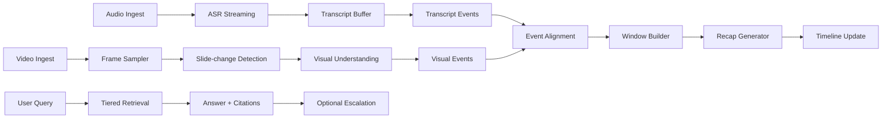

# MINUTE | Realtime online graph flow

Web app – Meetings + Workflow/Educational Assistant | Gemini 3 API | Multimodal realtime | Tiered LightRAG | Tool-calling có human-in-the-loop

Mục đích tài liệu: Mô tả chi tiết flow realtime theo dạng graph, pipeline xử lý audio và video đồng thời, cơ chế hợp nhất theo thời gian, tiêu chí độ trễ, hợp đồng WebSocket và các quyết định kỹ thuật để triển khai demo ổn định, có thể mở rộng.

---

## 1. Mục tiêu realtime
MINUTE realtime tập trung vào trải nghiệm in-session: hệ thống vừa cập nhật transcript và timeline, vừa tạo recap theo nhịp cố định, đồng thời hỗ trợ Q&A theo ngữ cảnh ngay trong phiên.

Mục tiêu cụ thể:
- Transcript streaming có timestamp, hỗ trợ partial và final.
- Hiểu video theo thời điểm: nhận biết nội dung trên slide, màn hình share, biểu đồ, đoạn code, bảng viết tay.
- Recap theo cửa sổ 2 phút, hiển thị dạng timeline, bám nội dung đang diễn ra.
- Q&A trong phiên theo LightRAG theo tầng, có kiểm chứng nguồn và cơ chế mở rộng tri thức có kiểm soát.
- Tool-calling theo đề xuất – phê duyệt – thực thi cho các hành động rủi ro, đặc biệt là web search.

---

## 2. Realtime graph overview
Realtime graph được tổ chức theo các node xử lý sự kiện, chạy song song theo 2 tuyến chính: audio và video. Output được hợp nhất tại Window Builder theo timecode để tạo ContextWindow dùng cho recap và Q&A.

Các tuyến xử lý chính:
- Audio lane: Audio Ingest -> ASR Streaming -> Transcript Buffer -> Transcript Events
- Video lane: Video Ingest -> Frame Sampler -> Slide-change Detection -> Visual Understanding -> Visual Events
- Merge lane: Event Alignment -> Window Builder -> Recap Generator -> Timeline Update
- In-session Q&A lane: User Query -> Tiered Retrieval -> Answer + Citations -> Optional Escalation

---

## 3. End-to-end data path (kết hợp in-meeting flow)
### 3.1 Production path (audio -> STT -> bus -> frontend)
1. Tạo session: `POST /api/v1/sessions` trả `session_id`, `audio_ws_url`, `frontend_ws_url`, `transcript_test_ws_url`.
2. Đăng ký nguồn & lấy token: `POST /api/v1/sessions/{session_id}/sources?platform=google_meet_tab` trả `audio_ingest_token`.
3. Client (browser) mở `WS /api/v1/ws/audio/{session_id}?token=...`, gửi `start`, sau đó stream PCM frames từ tab audio share.
4. Backend forward audio sang ASR streaming và nhận kết quả partial/final.
5. Backend chuẩn hoá payload, persist **final chunks** best-effort, cấp `seq`, publish `transcript_event` vào session bus (SSOT).
6. Session bus fan-out: Frontend distributor và LangGraph worker chạy graph.
7. Frontend mở một WS: `/api/v1/ws/frontend/{session_id}` để nhận `transcript_event` và state realtime.

### 3.2 Dev/Test path (bơm transcript thủ công)
- Client mở `WS /api/v1/ws/in-meeting/{session_id}` và gửi transcript chunk JSON.
- Backend gọi `ingestTranscript(..., source="transcript_test_ws")` rồi publish ra bus như production.

### 3.3 Handshake tối thiểu
- `audio_start_ack` xác nhận chấp nhận format audio.
- `audio_ingest_ok` xác nhận backend đã nhận frame đầu tiên.

---

## 4. Luồng realtime audio
### 4.1 Audio ingest
Nguồn audio lấy từ **tab Google Meet** đã share (system audio; mic có thể được trộn tuỳ cấu hình capture). Client chunk audio 20–60 ms và gửi qua WebSocket. Server chuẩn hoá format và gắn sequence để đảm bảo idempotency.

### 4.2 ASR streaming
ASR trả về transcript 2 dạng:
- Partial: cập nhật nhanh, phục vụ hiển thị live.
- Final (≈10s): dùng cho recap chính và lưu trữ.

### 4.3 Transcript buffer
Transcript events được lưu theo timestamp dạng segment có start_ms và end_ms, có thể bổ sung speaker nếu có diarization. Buffer hỗ trợ truy vấn theo khoảng thời gian để dựng cửa sổ recap.

---

## 5. Luồng realtime video và slide-change detection
### 5.1 Video ingest
Video có thể là screen share hoặc record. Với MVP, xử lý theo hướng sampling frame định kỳ hoặc theo sự kiện.

### 5.2 Frame sampler
- Mặc định 1 fps cho screen share ổn định.
- Có ROI cropping để ưu tiên vùng share screen và giảm nhiễu từ webcam overlay.

### 5.3 Slide-change detection nhẹ
Mục tiêu là phát hiện điểm chuyển slide nhanh và ít false-positive, không phụ thuộc OCR nặng.

Cơ chế đề xuất:
- Perceptual hash (dHash hoặc pHash) so sánh frame hiện tại với frame tham chiếu.
- Tạo candidate khi vượt ngưỡng khác biệt.
- Confirm bằng điều kiện bền vững 2–3 frame liên tiếp hoặc xác nhận bằng SSIM.

Tham số gợi ý:
- dHash 64-bit: candidate khi distance lớn hơn 10–18
- pHash 64-bit: candidate khi distance lớn hơn 12–20
- SSIM: confirm khi nhỏ hơn 0.90

### 5.4 Visual understanding
Chỉ chạy model cho frame quan trọng:
- Frame tại slide change
- Frame định kỳ (low rate) để bắt nội dung thay đổi nhỏ

Output VisualEvent tối thiểu:
- Slide: tiêu đề, ý chính, thuật ngữ nổi bật
- Chart: loại biểu đồ, xu hướng, điểm dữ liệu đáng chú ý
- Code: file hoặc hàm, lỗi hoặc đoạn đang thảo luận
- Whiteboard: ý chính, công thức, sơ đồ

---

## 6. Hợp nhất audio và video theo thời gian
### 6.1 Chuẩn hoá timebase
Tất cả sự kiện dùng ts_ms theo clock của server trong session để tránh lệch giữa client audio và video.

### 6.2 Event alignment
Gắn transcript segment vào visual event gần nhất theo khoảng cách thời gian, ví dụ +/- 3 giây. Ưu tiên visual event tại slide change làm anchor. Ưu tiên transcript segment có câu hỏi, quyết định, hành động.

### 6.3 ContextWindow
Mỗi cửa sổ 2 phút tạo một ContextWindow gồm:
- Transcript excerpt đã lọc
- Visual highlights trong khoảng thời gian
- Metadata session type và participants nếu có
- Danh sách citations dạng timestamp, frame_id, doc_id

---

## 7. Pipeline realtime recap
### 7.1 Window builder
- Window size mặc định 120 giây, có overlap 10–20 giây để giảm đứt mạch.
- Preview có thể dùng partial transcript.
- Recap chính dùng final transcript.

### 7.2 Recap generator
Gemini 3 nhận ContextWindow và trả về:
- Recap ngắn theo mẫu
- Key decisions hoặc key concepts tuỳ session type
- Danh sách citations bắt buộc cho các claim quan trọng

### 7.3 Persist và timeline update
Lưu RecapWindow vào storage, cập nhật SessionMemory và phát event cập nhật timeline cho UI.

Output realtime_recap:
- Recap windows theo timestamp
- Timeline realtime (audio + video)
- Video moments: frame + caption + ts_ms

### 7.4 Lưu trữ context cho LLM
Mục tiêu là có **điểm ghép** giữa transcript và video context theo session để prompt LLM ổn định.

Các bảng chính:
- `transcript_chunk`: chỉ lưu **final chunks** (khoảng mỗi 10s).
- `visual_event`: lưu slide change / frame hiểu ảnh.
- `context_window`: cửa sổ ghép **transcript_text + visual_context + citations** theo time window.

---

## 8. In-session Q&A theo LightRAG theo tầng
### 8.1 Mục tiêu và nguyên tắc
Q&A ưu tiên trả lời trong phạm vi session. Không mặc định web search. Nếu thiếu nguồn, hệ thống mở rộng theo tầng, có kiểm tra và có gating.

### 8.2 Flow Q&A
1. Query input.
2. Scope và policy check (session_id, ACL, web_allowed).
3. Tier 0 retrieval: recap windows, transcript, visual moments.
4. Tier 1 retrieval: tài liệu upload theo session (hybrid keyword + vector).
5. Rerank và context pack (top-k + citations).
6. Answer synthesis (Gemini 3).
7. Self-check và citation validation.
8. Nếu thiếu evidence hoặc mâu thuẫn, đề xuất Tier 2 web search theo cơ chế phê duyệt.
9. Corrective loop để trả lời lại có nguồn.
10. Nếu vẫn thiếu, Tier 3 deep research, multi-hop search và nêu giới hạn, độ tin cậy.

Output Q&A:
- Trả lời có nguồn trích dẫn.
- Phân biệt rõ nội dung trong session và nội dung từ web.
- Khi không đủ nguồn: trả lời best-effort kèm phần còn thiếu và gợi ý bổ sung.

---

## 9. WebSocket contract và sự kiện realtime
### 9.1 Client to server
- audio_chunk: seq, payload, ts_hint
- video_frame_meta: frame_id, ts_ms, roi, checksum
- user_query: query_id, text, scope
- approve_tool_call: proposal_id, approved, constraints
- session_control: start, pause, stop

### 9.2 Server to client
- transcript_event: partial hoặc final, start_ms, end_ms, text
- slide_change_event: ts_ms, confidence, diff_score
- visual_event: ts_ms, frame_id, type, caption
- recap_window: window_id, start_ms, end_ms, recap, citations
- tool_call_proposal: proposal_id, reason, suggested_queries, risk
- qna_answer: query_id, answer, citations, tier_used
- error: code, message

Nguyên lý vận hành từ in-meeting flow:
- Frontend nhận tất cả realtime qua một WS frontend.
- Audio ingest là WS riêng, chỉ dành cho bridge/bot.

---

## 10. Độ trễ, ổn định và vận hành
### 10.1 Mục tiêu độ trễ cho demo
- Transcript partial: dưới 1–2 giây từ lúc nói.
- Recap window: 5–15 giây sau khi cửa sổ kết thúc.
- Q&A Tier 0/1: 2–6 giây; Tier 2 tăng theo thời gian web search.

### 10.2 Chiến lược giảm trễ
- Chỉ chạy visual understanding cho frame quan trọng.
- Giới hạn context theo cửa sổ, ưu tiên đoạn có câu hỏi, quyết định, khái niệm.
- Cache embeddings theo session và cache web search theo query.

### 10.3 Observability
- Metrics: ws latency, asr lag, recap lag, qna latency theo tier, drop rate visual events.
- Tracing: request_id xuyên suốt event đến output.
- Audit: lưu vết tool call proposals và approvals.

---

## 11. Realtime video pipeline và slide-change detection (chi tiết MVP)
### 11.1 Mục tiêu kỹ thuật
- Phát hiện slide change với độ trễ thấp, đủ ổn định để làm mốc đồng bộ audio và video.
- Giảm false-positive do con trỏ, animation nhỏ, webcam overlay, thay đổi độ sáng hoặc nén video.
- Hạn chế chi phí inference: chỉ gửi frame cần thiết sang lớp hiểu hình ảnh.

### 11.2 Đầu ra mong muốn
- SlideChangeEvent: ts_ms, frame_id, confidence, diff_score.
- VisualEvent: ts_ms, frame_id, type, nội dung tóm lược có cấu trúc.

### 11.3 Nguồn ingest
- Screen share realtime: tab hoặc window capture.
- Record offline: file video mp4 hoặc mkv.

### 11.4 Chuẩn hoá ingest
- Timebase: mọi frame gắn ts_ms theo clock của server session.
- Kích thước: 1280x720 hoặc 960x540 để ổn định độ nhạy thuật toán.
- Màu: giữ bản màu cho hiểu ảnh; tạo bản grayscale cho detection.

### 11.5 Chính sách theo loại nguồn
- Screen share: ưu tiên độ trễ thấp, chạy liên tục, chịu được jitter.
- Record: ưu tiên tính đúng theo timestamp, cho phép decode theo keyframe.

### 11.6 Sampling policy
- Mặc định: 1 fps khi screen share ổn định.
- Tăng cường: 2 fps trong 10 giây sau khi có slide change.
- Tiết kiệm: 0.5 fps khi hệ thống quá tải hoặc phiên kéo dài.

### 11.7 ROI cropping
ROI cropping là bước bắt buộc trong MVP để giảm nhiễu từ webcam overlay và vùng UI thừa.

Cách triển khai MVP:
- ROI cấu hình thủ công: chọn vùng nội dung một lần khi bắt đầu session.
- Lưu ROI theo session_id: x, y, w, h.
- Áp ROI cho toàn bộ pipeline detection và hiểu ảnh.

Khuyến nghị:
- Nếu có webcam overlay: crop loại vùng overlay.
- Nếu share cửa sổ trình chiếu: crop sát vùng slide để tăng độ nhạy.

### 11.8 Chuẩn hoá frame cho detection
Trước khi tính dHash và SSIM, frame trong ROI được chuẩn hoá:
- resize về 320x180 để giảm chi phí.
- grayscale.
- làm mượt nhẹ để giảm nhiễu nén video.

### 11.9 Thuật toán hai lớp
- Lớp 1: phát hiện nhanh bằng dHash.
- Lớp 2: xác nhận để giảm false-positive.

### 11.10 Tham số khởi đầu và cách hiệu chỉnh
Tham số khởi đầu:
- dHash 64-bit: candidate khi distance lớn hơn 12–16.
- Xác nhận bền vững: 2 frame liên tiếp cho screen share ổn định, 3 frame nếu nhiều animation.
- SSIM: confirm khi nhỏ hơn 0.90.

Hiệu chỉnh thực tế:
- Nhiều false-positive do animation bullet: tăng ngưỡng distance lên 16–18, tăng xác nhận bền vững lên 3 frame, giữ SSIM 0.90 hoặc thấp hơn.
- Miss slide change do theme tương tự: giảm ngưỡng distance xuống 10–12 và crop ROI chặt hơn.
- Nhiễu do webcam overlay hoặc UI: ưu tiên sửa ROI trước, không ưu tiên giảm ngưỡng.

### 11.11 Quy tắc cập nhật frame tham chiếu
Khi xác nhận slide change:
- cập nhật ref_frame và ref_hash sang frame mới.
- reset bộ đếm xác nhận.
- phát SlideChangeEvent tại ts_ms của frame xác nhận.

### 11.12 SlideChangeEvent tối thiểu
SlideChangeEvent gồm:
- ts_ms
- frame_id
- confidence
- diff_score: hash_dist và ssim
- roi: thông tin vùng crop đã áp dụng

Gợi ý confidence:
- Cao khi hash_dist lớn và SSIM thấp rõ rệt.
- Trung bình khi vừa đủ ngưỡng, cần dựa thêm vào bền vững.

### 11.13 Visual understanding
Chính sách chọn frame để gọi model:
- Frame tại slide change đã xác nhận.
- Frame định kỳ low rate, ví dụ mỗi 20–30 giây.
- Frame có biến động lớn kéo dài nhưng không đủ điều kiện xác nhận do animation.

Kiểm soát chi phí và độ trễ:
- Detection chạy realtime.
- Visual understanding chạy theo hàng đợi ưu tiên.
- Ưu tiên cao cho slide change frame, ưu tiên thấp cho periodic frame.
- Giới hạn tần suất gọi model theo session để tránh trễ tích luỹ.

VisualEvent tối thiểu:
- Slide: title, bullets 3–5 ý chính, keywords.
- Chart: chart_type, trục và xu hướng chính, điểm dữ liệu đáng chú ý nếu đọc được.
- Code: language, focus_area (file, function, snippet), issues hoặc điểm thảo luận.
- Whiteboard: key_points, formulas, relationships.

Liên kết với pipeline tổng thể:
- VisualEvent gắn ts_ms và frame_id, lưu vào session memory.
- Window Builder ưu tiên VisualEvent tại slide change để tạo ContextWindow.
- Q&A Tier 0 dùng VisualEvent như nguồn trong phiên, kết hợp transcript và recap windows.

---

## 12. Kiểm thử và tiêu chí chấp nhận
### 12.1 Test cases tối thiểu
- Slide chuyển rõ ràng: phát hiện ổn định.
- Animation bullet: không spam slide change.
- Có webcam overlay: ROI crop giảm false-positive rõ rệt.
- Chuyển từ slide sang code editor: phát hiện ổn định.
- Nén video và đổi sáng nhẹ: detection không dao động mạnh.

### 12.2 KPI cho demo
- Slide change latency: dưới 1–2 giây sau thời điểm chuyển.
- False-positive rate: không quá 1 lần mỗi 5–10 phút với slide ổn định.
- Model calls: chủ yếu tại slide change và periodic low rate, không chạy theo fps cao.
